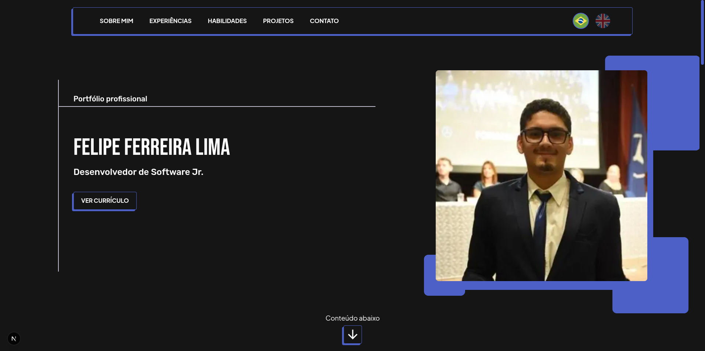
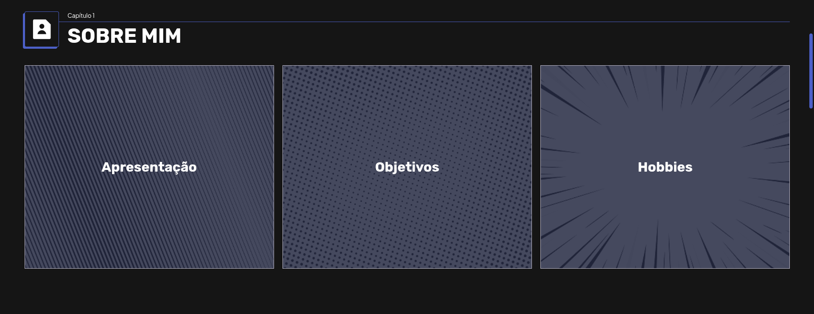
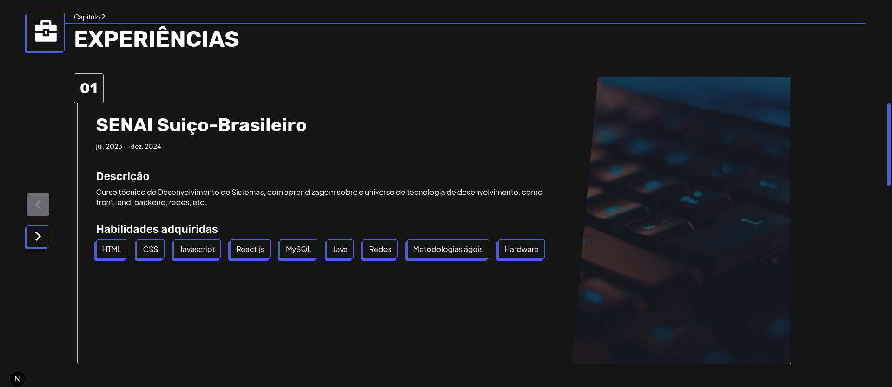
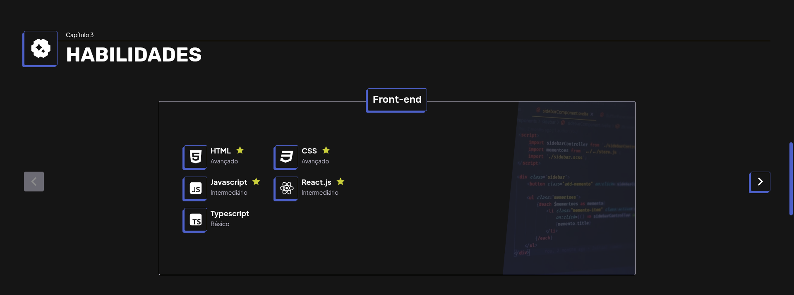
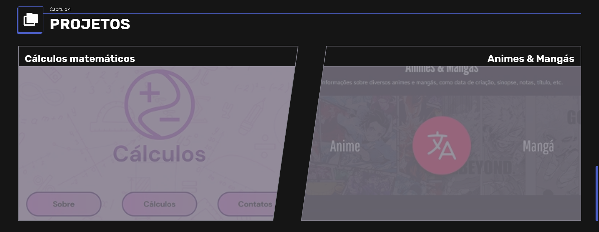
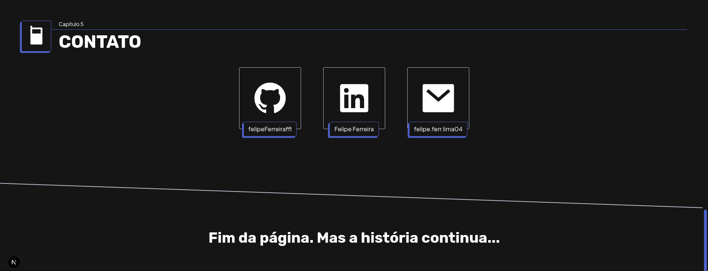

# Professional portfolio

## Index

- [About](#about)
- [Features](#features)
- [Stack](#stack)
- [Getting started](#getting-started)
- [Preview](#preview)
- [Author](#author)

## About

Professional portfolio made by **Felipe Ferreira Lima** — a landing page that showcase my skills, projects and experiences thoughout my journey as a front-end developer, prioritizing performance, accessibility and best practices, such as internationalization to foreign language (PT-BR/EN).

This project was designed prioritizing performance, accessibility and internationalization (PT-BR/EN). The visual concepts relies on a professional looking portfolio and on manga panels layout: rectangular elements, diagonal cuts and minimal rounded corners.

Check out the Figma design for reference:
[](https://www.figma.com/design/tkG2yw8HLbBKX20WfltUwi/Portfolio-Design?m=auto&t=eGOqL4fxuByInN7i-6)

## Features
- Build with Next.js 16 and React 19
- Internationalization (PT-BR/EN) via i18next
- Manga panel design inspiration
- Animations with Framer Motion
- Responsive layout
- Accessibility-first approach
- Performance check
- Deployed on Vercel

## Stack

### Core
  

### Libraries
[](https://motion.dev/) [](https://react-svgr.com/) [](https://remixicon.com/) [](https://www.embla-carousel.com/)

### Deployment
[](https://vercel.com/)

## Getting started

### Prerequisites
- Node.js >= v24.12.0
- npm

### Installation
```bash
git clone https://github.com/felipeFerreiraffl/felipe-portfolio
cd felipe-portfolio
npm i
npm run dev
```

## Preview

### Hero


### About me


### Experiences


### Skills


### Projects



### Contact


## Author

This project was made by **Felipe Ferreira Lima**, a Junior Front-end Developer building dreams and a career journey on IT world.

Follow me or send an email for connection.

[](mailto:felipado2x0@gmail.com) [](mailto:felipe.ferr.lima04@gmail.com) [](https://www.linkedin.com/in/felipe-ferreira-959bb8271) [](https://www.instagram.com/felipe_ffl7)
